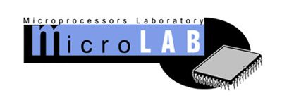

<!-- PROJECT LOGO -->
 

  

<h1 align="center">Microcomputers 2025</h1>

<!-- TABLE OF CONTENTS -->

  
Table of Contents

  <ul>
    <li><a href="#about-the-projects">About The Projects</a></li>
    <li>
      <a href="#project-1">Project 1</a>
      <ul>
        <li><a href="#exercise-1.1">Exercise 1.1</a></li>
        <li><a href="#exercise-1.2">Exercise 1.2</a></li>
        <li><a href="#exercise-1.3">Exercise 1.3</a></li>
      </ul>
    </li>
    <li>
      <a href="#project-2">Project 2</a>
      <ul>
        <li><a href="#exercise-2.1">Exercise 2.1</a></li>
        <li><a href="#exercise-2.2">Exercise 2.2</a></li>
        <li><a href="#exercise-2.3">Exercise 2.3</a></li>
      </ul>
    </li>
    <li><a href="#contributors">Contributors</a></li>
    <li><a href="#license">License</a></li>
    <li><a href="#contact">Contact</a></li>
    <li><a href="#acknowledgments">Acknowledgments</a></li>
  </ul>

<!-- ABOUT THE PROJECT -->
# About The Projects

This repository contains the weekly projects of the course Microcomputers Lab 2025.

(<a href="#readme-top">back to top</a>)

<!-- PROJECT 1 -->
# Project 1
This is an introductory project consisting of 3 exercises. 
 
## Exercise 1.1
The exercise wants us to implement a delay routing. Specifically, the *wait_x_msec* routine... The correcteness of the solution is evaluated utilizing the stopwatch of the debugger.

## Exercise 1.2
The exercise wants us to calculate 2 Boolean Algebra expressions. In order to achieve that we create 2 functions F0 and F1 that perform the calculation.

## Exercise 1.3
Using the routine implemented in exercise 1.1, we created a virtual train. The train is an LED light moving from PORTD's LSB to MSB and back having delays in between. 

(<a href="#readme-top">back to top</a>)

<!-- PROJECT 2 -->
# Project 2
This is a project about ATmega328PB interrupts. It provides documentation about the interrupts and consists of 3 exercises.

## Exercise 2.1

## Exercise 2.2

## Exercise 2.3

(<a href="#readme-top">back to top</a>)

# Contributors
+ Dimitrios ([DimPanta](https://github.com/DimPanta)) Pantazis
+ Nikolaos ([orion-3464](https://github.com/orion-3464)) Kordas

(<a href="#readme-top">back to top</a>)

